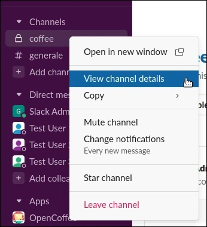

# OpenCoffee

[](https://opensource.org/licenses/MIT)
[](https://www.python.org)
[](https://python-poetry.org/)
[](https://github.com/pylint-dev/pylint)


A simple, open-source, localizable, extensible, and [privacy-respecting](#permissions-details) solution (self-hostable with minimal permissions) designed to facilitate connections among colleagues through Slack.  
It takes all the members in a Slack channel and pairs them up for a coffee date.

This solution promotes knowledge sharing, improves communication, and facilitates periodic random introductions, one coffee :coffee: at a time.

While there are various open-source scripts that accomplish similar tasks, the project aims to provide a minimal set of configurations to enhance flexibility.

## Contents

1. [Getting started](#getting-started)
2. [Permissions details](#permissions-details)
3. [Step by step configuration](#step-by-step-configuration)
    - [Slack account](#slack-account)
    - [OpenCoffee configuration](#opencoffee-configuration)
4. [Translation](#translation)
5. [Licences](#licences)

## Getting started

Run the following to install and launch OpenCoffee using [Poetry](https://python-poetry.org):

```console
$ git clone https://github.com/YellowSakura/opencoffee.git
$ cd opencoffee
$ poetry install
$ poetry run main --help
```

N.B: Poetry is the dependency manager used by the project, for more information on how to install it, please refer to the [official documentation](https://python-poetry.org/docs).  
Alternatively, you can simply run the following command for an easier setup:

```console
$ curl -sSL https://install.python-poetry.org | python3 -
```

To use the following commands, you need a valid configuration file named `config.ini`.  
Alternatively, you can use any other configuration file by specifying it with the `--conf FILE/PATH` option.

For more details on how to manage a configuration file, please refer to the [OpenCoffee configuration](#opencoffee-configuration) section.

To execute an invitation step and send messages to pairs generated from your Slack channel, use the command:

```console
$ poetry run main -a invitation
```

On the other hand, with the command:

```console
$ poetry run main -a reminder
```

You can perform a reminder step by sending messages to the last pairs generated from the invitation step, reminding them to schedule a coffee date.  
This reminder will not be sent to people who have already communicated with each other in the chat created from OpenCoffee.

The idea is to manage both of the previous commands with cron executions, for example, every Monday for the invitation step, and every Thursday for the reminder step.

---

From a development standpoint, there are other useful commands available through [Poe the Poet](https://github.com/nat-n/poethepoet).

Using the following command, you can execute a full static type checker using [Mypy](https://mypy-lang.org):

```console
$ poetry run poe mypy
```

You can perform static code analysis using [Pylint](https://pypi.org/project/pylint/) with the following command:

```console
$ poetry run poe pylint
```

For running a complete set of tests using [pytest](https://docs.pytest.org/en), use the following command:

```console
$ poetry run poe pytest
```

For count the number of source code lines using [Pygount](https://github.com/roskakori/pygount), use the following command:

```console
$ poetry run poe pygount
```

Finally, to assess the overall quality of OpenCoffee, you can use the following command, which executes all the previous commands with the exception of Pygount:

```console
$ poetry run poe quality
```

## Permissions details

OpenCoffee aims to make use of a minimal set of Slack permissions for its operation, specifically:

- [channels:read](https://api.slack.com/scopes/channels:read) (optional): This permission is not mandatory, but it enables to view basic information about public channels in a workspace.  
  It is only required when using the ```'max-distance'``` algorithm, for more details, please refer to the 'OpenCoffee configuration' section.
- [chat:write](https://api.slack.com/scopes/chat:write) (mandatory): This permission is required to send messages in a group with people created by the bot;
- [groups:read](https://api.slack.com/scopes/groups:read) (mandatory): This permission is necessary to retrieve basic information about private channels that the bot has been added to, and it is used to access all members in the initial channel;
- [mpim:history](https://api.slack.com/scopes/mpim:history) (mandatory): This permission is used to view messages and other content in group direct messages that the bot has been added to.  
  It is required to empirically check if users in a group created by the bot arrange a coffee date;
- [mpim:write](https://api.slack.com/scopes/mpim:write) (mandatory): This permission allows the bot to start group direct messages with people.  
  It is used in conjunction with ```'chat:write'``` to create a "dialog bridge" between people.

## Step by step configuration

In this section, we will go through step-by-step instructions on how to set up the integration on Slack and and the necessary details to configure OpenCoffee.

### Slack account

The prerequisite is having a pre-configured Slack account with administrator access credentials available.

1. Log in to your Slack administrator account and navigate to the following page: ```https://api.slack.com/apps```
2. Click on "Create an App":

<p align="center" width="100%"></p>

3. Select "From an app manifest":

<p align="center" width="100%"></p>

4. Select your workspace and then click "Next":

<p align="center" width="100%"></p>

5. Replace the YAML code in the corresponding tab with the following one, and then click 'Next':

```yaml
# Schema details can be found at: https://api.slack.com/reference/manifests#metadata
display_information:
  name: OpenCoffee
  long_description: "A simple, open-source, localizable, extensible, and privacy-respecting solution (self-hostable with minimal permissions) designed to facilitate connections among colleagues through Slack.\nIt takes all the members in a channel and pairs them up for a coffee date.\n\nThis solution promotes knowledge sharing, improves communication, and facilitates periodic random introductions, one coffee at a time.\n\nhttps://github.com/YellowSakura/opencoffee"
  description: It takes all the members in a channel and pairs them up for a coffee date
  background_color: "#86523e"
features:
  bot_user:
    display_name: OpenCoffee
    always_online: false
oauth_config:
  scopes:
    bot:
      - channels:read
      - chat:write
      - groups:read
      - mpim:history
      - mpim:write
```
6. Click on "Create":

<p align="center" width="100%"></p>

7. [**Optional**] Edit the "Display Information," such as changing the description or the icon using the `docs/coffee-cup.png` file, and then click "Save":

<p align="center" width="100%"></p>

8. Click on "Install to Workspace" in the "Install your app" section and then click on "Allow":

<p align="center" width="100%">
  
  
</p>

9. Go to the "OAuth & Permissions" menu and copy the "Bot User OAuth Token" from the "OAuth Tokens for Your Workspace" section.  
This token will be the value you'll use in the OpenCoffee configuration file, value ```api_token```:

<p align="center" width="100%"></p>

10. Open the Slack application and log in using an admin user account

11. Create a new public or private channel, such as #coffee (maybe use a little more imagination :wink:), and add a few test users to it

12. Right-click on the OpenCoffee app and select "View app details":

<p align="center" width="100%"></p>

13. Copy the "Member ID", this value will be used in the OpenCoffee configuration file, value ```ignore_users```:

<p align="center" width="100%"></p>

14. Click on "Add this app to a channel", then select the channel you previously created and finally click on "Add":

<p align="center" width="100%"></p>

15. Right-click on your previously created channel and select "View channel details":

<p align="center" width="100%"></p>

16. Copy the "Channel ID" located at the bottom of the "About" section, this value will be used in the OpenCoffee configuration file, value ```channel_id```:

<p align="center" width="100%"></p>

### OpenCoffee configuration

To define your configuration file, you can start from ```config-sample.ini``` by creating a copy of it.

The various entries that constitute it are documented in the sample file, the most important are:

* ```api_token```: Required for communicating with the Slack APIs, this value is obtained in step 9 of the Slack account setup process;
* ```channel_id```: Required to identify the channel containing users involved in the OpenCoffee logic, this value is obtained in step 16 of the Slack account setup process;
* ```ignore_users```: A list of users belonging to the ```channel_id``` to be ignored.  
  You must at least include the OpenCoffee users as explained in step 13 of the Slack account setup process;
* ```generator_algorithm_type```: Determine the type of algorithm used to generate coffee break pairings.  
  Possible values are: ```simple``` or ```max-distance```.  
  The ```'simple'``` is the fastest algorithm and generates random combinations, while the ```'max-distance'``` is slower, but aims to create pairings of individuals who, through heuristics, tend to work less closely together.  
  Default value is ```simple```.  
  ATTENTION: The use of ```'max-distance'``` requires the ```'channels:read'``` permission in the Slack app configuration.

Of course, you can have different configuration files that involve different channels, languages, and any other combination of configurations.

## Translation

OpenCoffee uses a very small set of messages that require translation, so if you want to translate it, it's really simple, here's what you need to do:

1. Run the following command:

   ```console
   pygettext3 -d messages -o opencoffee/locales/base.pot opencoffee/
   ```

   Make sure you have the `pygettext` package installed on your system.

2. The previous command will generate a file called `message.po` in the `opencoffee/locales` directory.  
   Now, copy this file to `opencoffee/locales/%ISO CODE%/LC_MESSAGES/message.po` where `%ISO CODE%` is your [ISO-639-1](https://en.wikipedia.org/wiki/List_of_ISO_639-1_codes) language code.

3. Translate the `message.po` file you created earlier by adding translations in the `msgstr` sections.

4. Run the following command in the folder containing your `message.po` file:

   ```console
   msgfmt messages.po -o messages.mo
   ```

5. Change the `language` field in your `config.ini` file using your `%ISO CODE%`.

## Licences

The code is licensed under the [MIT](https://opensource.org/licenses/MIT) by [Yellow Sakura](https://www.yellowsakura.com), [support@yellowsakura.com](mailto:support@yellowsakura.com).

Dependencies:

 * [Argparse](https://docs.python.org/3/library/argparse.html) is licensed under [Python Software Foundation License (PSFL)](https://docs.python.org/3/license.htm) by Steven J. Bethard;
 * [Mypy](https://mypy-lang.org) is licensed under [MIT License](https://opensource.org/licenses/MIT);
 * [Poe the Poet](https://github.com/nat-n/poethepoet) is licensed under [MIT License](https://opensource.org/licenses/MIT);
 * [Pygount](https://github.com/roskakori/pygount), is licensed under [BSD license](https://opensource.org/license/bsd-3-clause);
 * [Pylint](https://github.com/pylint-dev/pylint) is licensed under [GPLv2 license](https://github.com/pylint-dev/pylint/blob/main/LICENSE) and [other licenses](https://github.com/pylint-dev/pylint#license);
 * [pytest](https://docs.pytest.org/en) is licensed under [MIT License](https://opensource.org/licenses/MIT);
 * [Python](https://www.python.org) is licensed under [Python Software Foundation License (PSFL)](https://docs.python.org/3/license.html) by Python Software Foundation (PSF);
 * [Python Slack SDK](https://slack.dev/python-slack-sdk) is licensed under [MIT License](https://opensource.org/licenses/MIT) by Slack Technologies, LLC;
 * [SciPy](https://scipy.org) id distributed under a liberal [BSD license](https://github.com/scipy/scipy/blob/main/LICENSE.txt);
 * [tqdm](https://github.com/tqdm/tqdm) is licensed under [MIT License](https://opensource.org/licenses/MIT) and [other licenses](https://github.com/tqdm/tqdm/blob/master/LICENCE).

Images:

 * Mug icons in `docs/coffee-cup.png` created by [Freepik - Flaticon](https://www.flaticon.com/free-icon/coffee-cup_1889938)